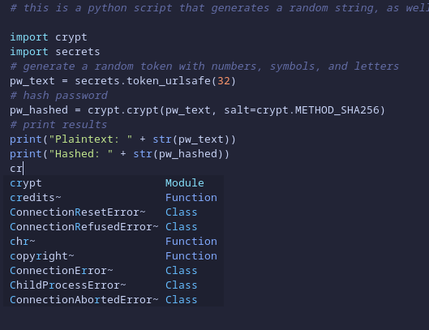

# nvim-makeover

  

*Here's what your text editor could look like...* 

Are you tired of having a boring-looking vim console? Are you secretly jealous of your friends who use VS Code with a gorgeous theme, even though you keep telling them that their IDE is just bloatware made by Microsoft shills? Do you view nano users as somewhere between phytoplankton and krill on the UNIX food chain? If so, this script might be for you!

### What is LSP?

If we want to beautify our text editor, neovim is the easiest starting point:
```
sudo dnf install neovim
```
Ok, yeah, I know, REAL UNIX users write their code on clay tablets or whatever. Take a deep breath. It's still a vi fork.  

Neovim has a feature called LSP (Language Server Protocol) which allows it to connect as a client to installed language servers. This allows for a tremendous amount of feature configuration, including theme additions, autocomplete for many languages, syntax highlighting, and error detection.  

Before we get into modifying nvim, let's add some language servers. For a bash server, make sure you have java environment installed and then run:
```
npm i -g bash-language-server
```
Similarly, let's add a python language server:
```
python3 -m pip install -U jedi-language-server
```
I like installing this globally, but you can always make a seperate environment for this package. Once you have some language servers installed, we can move on to the nvim configuration.

### Using a plugin manager

A plugin manager will make this process significantly easier. lazy.nvim is a great choice. Don't worry, even though it has lazy in its name, you are still superior to those silly IDE-users. First check the path of where your nvim configuration file should go:
```
nvim --headless -c 'echo stdpath("config")' -c 'echo ""' -c 'quit'
```
This is usually /home/*[user]*/.config/nvim, and you'll probably have to make the nvim directory with:
```
mkdir /home/*[user]*/.config/nvim
```
And then the config file with:
```
touch /home/*[user]*/.config/nvim/init.lua
```
Now make sure that the above file is opened when you run:
```
nvim -c 'edit $MYVIMRC'
```  
Time for the actual install! Copy the provided init.lua script in this repo to /home/*[user]*/.config/nvim/init.lua on your system. This script will also install Tokyo Night, which is a really pretty pastel color scheme for nvim:
```
cp init.lua /home/*[user]*/.config/nvim/init.lua
```
Now run nvim to automatically perform installs of the theme and several quality of life packages to make working with LSP easier:
```
nvim
```
Open up a .py or .sh file with nvim. You should now see that you have syntax highlighting and the ability to autocomplete commands!

### It didn't work! The first block of code in your lua script failed!

Don't worry, you probably just need to compile nvim from source to get the newest version. Some distros (I'm looking at you, Debian, and you, Rocky) have package managers with repos that contain very old versions of nvim. If you need to compile from source, start by removing the config file and directory you made before, then uninstalling nvim:
```
sudo dnf remove neovim
rm -rf /home/*[user]*/.config/nvim
```
Now make sure you have the build prerequisites installed:
```
sudo dnf install git ninja-build cmake gcc make unzip gettext curl glibc-gconv-extra
```
Clone the source code into /opt:
```
sudo git clone https://github.com/neovim/neovim /opt
```
Now change your directory to the newly cloned one and build the package:
```
cd /opt/neovim
sudo make CMAKE_BUILD_TYPE=RelWithDebInfo
```
Install the binary into /usr/local with:
```
sudo make install
```
Now try the previous steps again to install lazy.nvim.

### This still doesn't work!

Open nvim and run the command ``:checkhealth``. This will provide you with the debug information you'll need to troubleshoot. There's a lot of moving parts here, and the potential for things to go wayside.

### Additional information

This guide was heavily inspired by the [lsp-zero tutorial](https://lsp-zero.netlify.app/docs/tutorial).

**Additionally, here's some information on the packages used in this process:**   
[neovim](https://github.com/neovim/neovim?tab=readme-ov-file)  
[lazy.nvim](https://github.com/folke/lazy.nvim)  
[tokyotonight](https://github.com/folke/tokyonight.nvim)  
[bash-language-server](https://github.com/bash-lsp/bash-language-server)  
[jedi-language-server](https://github.com/pappasam/jedi-language-server)  
[lsp-zero](https://github.com/VonHeikemen/lsp-zero.nvim)  
[nvim-lspconfig](https://github.com/neovim/nvim-lspconfig/tree/master)  
[cmp-nvim-lsp](https://github.com/hrsh7th/cmp-nvim-lsp)  
[nvim-cmp](https://github.com/hrsh7th/nvim-cmp)  

*"I started using vim about 6 months ago, and I haven't touched another text editor since. Mainly because I can't figure out how to close it."*
